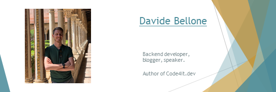
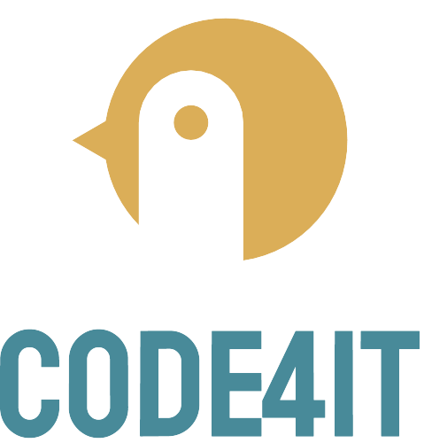

Hey there, I'm Davide, a backend developer from Italy 🤏 

My story, in short:

* CS Degree in Turin, around 2014
* Backend developer, focused on SharePoint (2014 -> 2016)
* Fullstack developer, taking care of everything: SQL, UI, and everything in between (2017)
* Fullstack developer/mentor: Angular + .NET API (2017->2019)
* Backend developer (2019 -> today)
* Backend dev/Architect (in the future - I hope 😉)

## Where to spot a Davide in the wild 🦏

and, of course...

[ My blog: Code4it.dev](https://www.code4it.dev/)

## My latest blog posts

<!-- BLOG-POST-LIST:START -->
- [Clean Code Tip: Avoid subtle duplication of code and logic](https://www.code4it.dev/cleancodetips/avoid-subtle-duplication)
- [How to improve Serilog logging in .NET 6 by using Scopes](https://www.code4it.dev/blog/serilog-logging-scope)
- [C# Tip: use IHttpClientFactory to generate HttpClient instances](https://www.code4it.dev/csharptips/use-httpclientfactory-instead-of-httpclient)
- [8 things about Records in C# you probably didn&#39;t know](https://www.code4it.dev/blog/8-things-about-records-csharp)
- [Clean Code Tip: Tests should be even more well-written than production code](https://www.code4it.dev/cleancodetips/tests-should-be-readable-too)
<!-- BLOG-POST-LIST:END -->

## Some wise words for you

